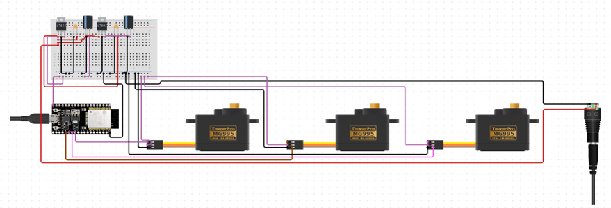
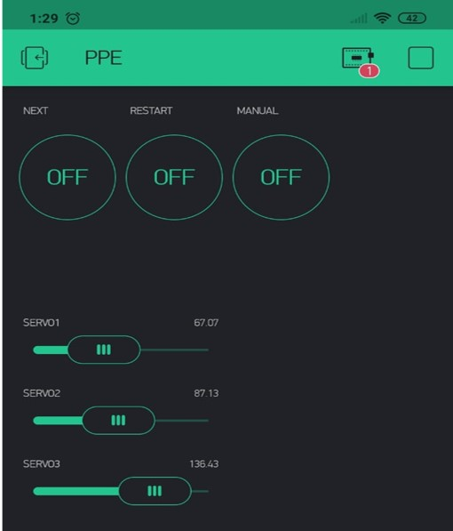
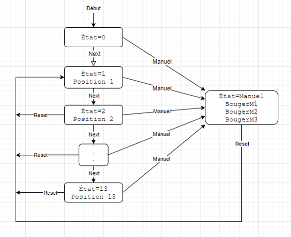
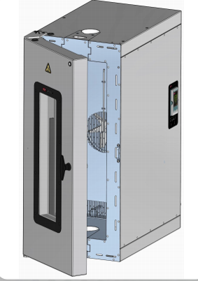
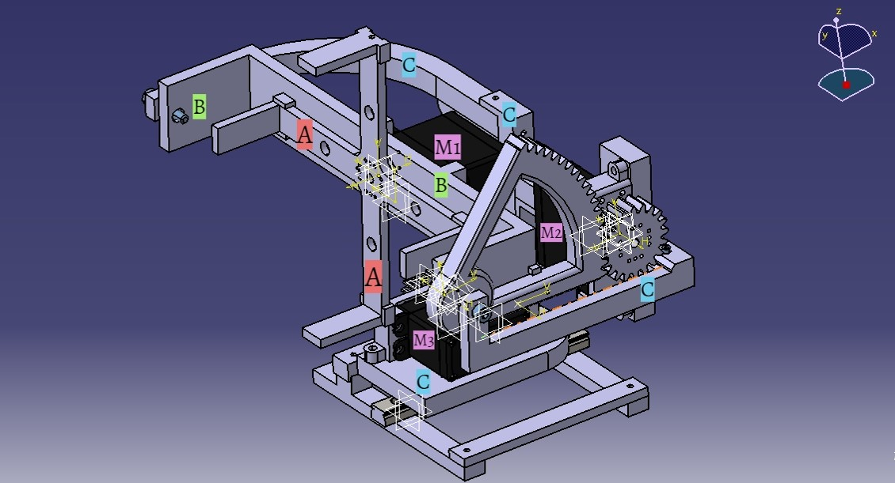

# PPE

Optic measurements for deformations usually need to take pictures of the target in diferent position so either you have to move the camera, or you have to move the object.

The objective of this project its to position a square target in 13 different positions shown in the folloing image:

All these 13 steps can be achived by only 3 movements:

-A rotation arround an axis thats perpendicular to the target face and passes throug the center of that face

-A translation on that same axis 

-A rotation arround an axis contained on the front face of the target. Means its gonna rotate arround the center of his own front face (shown in steps 4 and 5) 

To do so we need to control the position of 3 motors (servomotors in this case) so we connect our ESP32 card in the following way 

Then we proceeded to build a simple HMI(Human-Machine Interface) using blink (using your cellphone) that looks like this 

to be able to command the motors remotly

To simplify things for the users he can either move each motor manually (pressing the manual button and moving the sliders) or use the automatic positioning to pass from one position to the next one using the NEXT button.

He can also restart the sequence using the restart button 

Here is the state diagram:

After that we are ready to build a mecanic design to reproduce all those movements having in consideration the dimentional constrains of the target enviroment (cant be too big)

Enviroment:

Mecanical conception using CATIA:

-The motor 1 is attached to structure B and his axis passes through structure B to hold and turn the structure A witch holds the target (reproducing the 1st movement described)
-The big gear is solid to structure B and the motor 2 (moving the small gear) is attached to structure C.The struture B is been holded by the structure C but it turns freely. Reproducing the 3rd movement.
-Finally the motor 3 (moving the pignon) is also attached to structure C
The pignon of motor 3 works with a rack to move the entire system reproducing the 2nd movement described.

All the system has been designed for their parts not to collide under any circumstances

